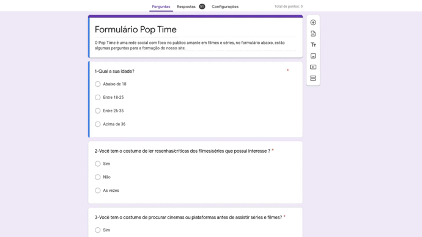
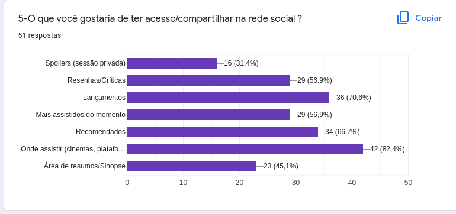
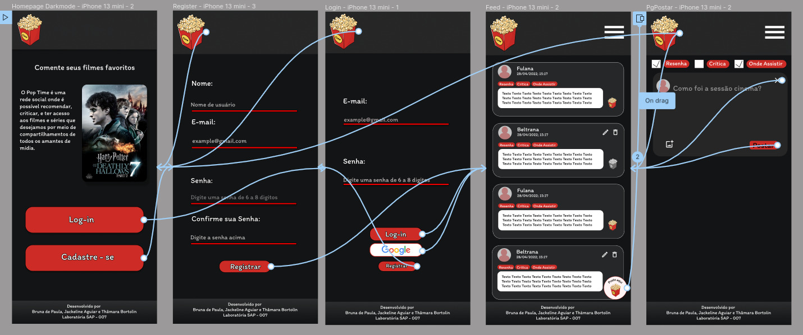
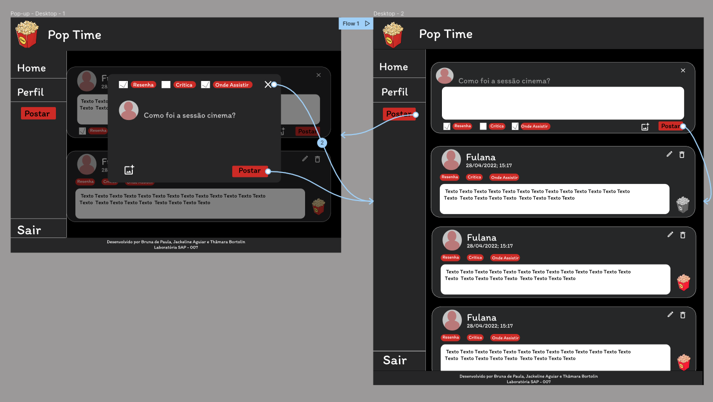

# Pop Time

## Índice

* [1. Pop Time - Seu momento pipoca](#1-pop-time---seu-momento-pipoca-🍿)
* [2. Histórias de Usuário](#2-histórias-de-usuário)
* [2.1. Pesquisa com público](#21-pesquisa-com-o-público)
* [2.2. Histórias de Usuário](#22-histórias-de-usuário)

***

## 1. Pop Time - Seu momento pipoca 🍿

O Pop Time surgiu com a ideia de ser uma rede social para compartilhar e buscar indicações de filmes e séries, sendo um espaço para discutir os últimos lançamentos da 7ª Arte.

## 2. Histórias de Usuário
### 2.1. Pesquisa com o público

Foi criado um Formulário de pesquisa para identificar qual a feixa etária do nosso público alvo, e quais os assuntos de maior interesse para serem públicados na rede social.

Com base nas respostas pudemos observar os interesses dos usuários em potêncial, que em sua maioria eram jovens (18 - 25 anos).

 

 ### 2.2. Histórias de Usuário

* Penélope

*Fulana,* 23 anos, eventualmente pesquisa sobre **resenhas e críticas de filmes e séries** que têm interesse, apesar de **pesquisar os cinemas e as plataformas** para assisti-los. *Fulana* gostaria de uma rede-social com informações sobre **onde assistir e** **recomendados.**

* Morgana

*Beltrana*, 30 anos, sempre pesquisa sobre **resenhas e críticas de filmes e séries** que têm interesse, apesar de as vezes **pesquisar os cinemas e as plataformas** para assisti-los. *Beltrana* gostaria de uma de uma rede-social com informações sobre **lançamentos e resenhas críticas.**

## Protótipos Pop Time

### Baixa Fidelidade

### Alta Fidelidade - Desenvolvido no Figma

 Páginas Mobile 
 

 Páginas Descktop 
 
